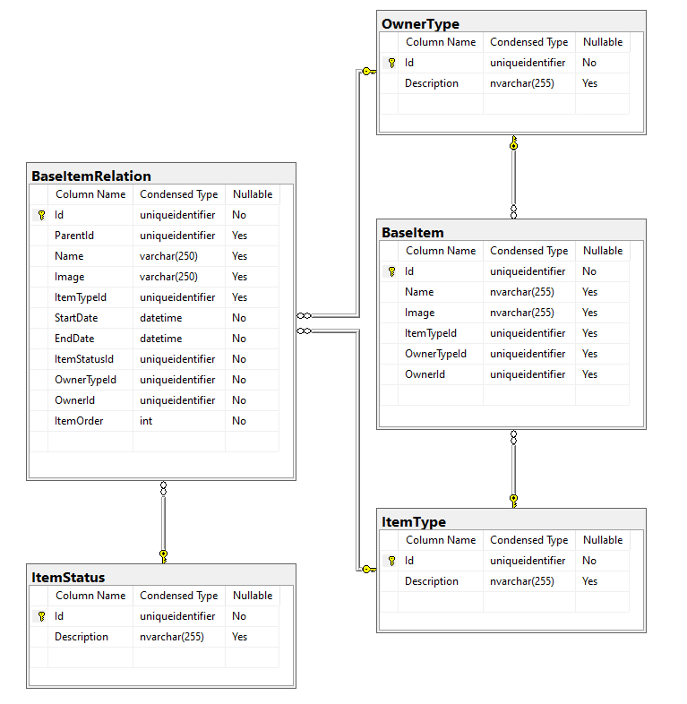

# Projeto de estudo para criação de árvore hierárquica


### Contexto

A Aplicação original era destinada a um software de OKR.
A analise original determinou tabelas separadas por item. 
Sendo os itens: ActionPlan, Objetive, Task, ItemTask

Cada tabela com tabelas de apoio para árvore sendo tabelas Parent e Child
gerando um total de  doze (12) tabelas para a montagem da árvore.

### Requistos da estrutura
1- Permitir a construção da arvore à partir de qualquer item dela.
2- Permitir a construção tanto de ascendentes, quanto de descendentes à partir do item escolhido
3- Permitir escolher entre a montagem dos ascendentes com todos os filhos
   ou somente com filhos referentes ao item escolhido como inicial
4- Permitir que itens fossem reaproveitados em outras árvores
5- Permitir  um controle de visualização por usuario (Owner) ou grupo de usuários (TypeOwner)
6- Permitir o controle individual do status de andamento de cada item

### O que foi percebido

A estrutura original: ActionPlan, Objetive, Task, ItemTask apesar de separada era composta
de itens com estruturas gêmeas.

Para efeitos de estudo foi feita a opção pela simplificação da estrutra.

#### Prós

1- Simplificação da estrutura, facilitando a manutenção, exitiria apenas uma estrutura; Item
2- Redução do número de tabelas de doze(12) para duas(2) sem contar tabelas de apoio
2- Expansão infinita de novos itens
3- Controles como status, usuarios e outros poderiam ser unificados atendendo a qualquer item

#### Contras

1- Simplificação redução das tabelas implica em tabalhar com tabelas maiores podendo ocorrer impacto
   na performace
2- Alteração de Id de um item quando ele se torna um item de uma arvore, não impede rastreamento, mas
   requer atenção por parte do programador.   
3- Replicação de algum dados, mas esta abordagem permite alterar um item quase completamente 
   dependendo a arvore onde se encontra.

### Particularidades da codificação

1- Optou-se pela utilização de função recursiva, tanto quanto possível para redução de código
2- Estruturas de controle de usuário e status estão presentes mas não foram implementadas
3- Estruturas de controle de erro não foram implementadas, pois podem variar de acordo com o código onde
   as rotinas de montagem de arvore for implementada.
4- Foi usado Dapper puro sem nenhum framework de acesso à dados como Hibernate ou Entity
5- Foi montando apenas um teste unitário simples do endpoint de montagem da arvore


### Exemplos da montagem da arvore

#### ARVORE COMPLETA
```
Item: 30
├── Item: 1
│   ├── Item: 10
│   ├── Item: 20
│   │   ├── Item: 100
│   │   └── Item: 200
│   └── Item: 30
│       ├── Item: 400
│       └── Item: 500
├── Item: 400
└── Item: 500
```
### ITEM 20 ESCOLHIDO 
### SOMENTE DESCENTENTES
```
Item: 20 ****
├── Item: 100
└── Item: 200
```

### ITEM 20 ESCOLHIDO 
### DESCENTENTES E SOMENTE ASCENDENTE COM FILHOS LIGADOS AO ITEM 20
```
Item: 30
└── Item: 1
    └── Item: 20 ****
        ├── Item: 100
        └── Item: 200
```

### ITEM 20 ESCOLHIDO 
### DESCENTES E ASCENDENTES (ÁRVORE COMPLETA)
```
Item: 30
├── Item: 1
│   ├── Item: 10
│   ├── Item: 20 ****
│   │   ├── Item: 100
│   │   └── Item: 200
│   └── Item: 30
│       ├── Item: 400
│       └── Item: 500
├── Item: 400
└── Item: 500
```

### Diagrama do banco 



