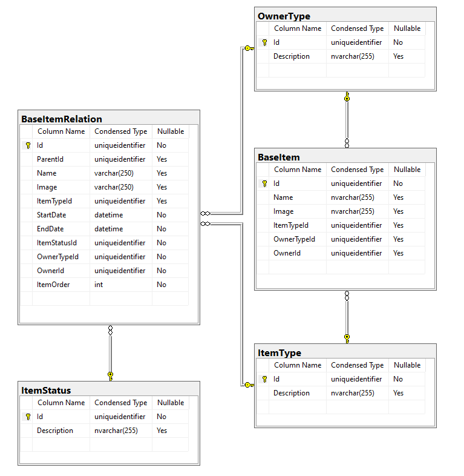

# Estudo de Estruturas Hierárquicas e Árvores Recursivas

Este repositório contém um projeto de estudo focado na implementação e otimização de estruturas de dados hierárquicas. O objetivo principal é explorar a transição de um modelo de dados fragmentado para uma abordagem unificada e eficiente.

---

## 1. Contexto do Projeto

Originalmente, a arquitetura foi concebida para um software de **OKR (Objectives and Key Results)**. Na análise inicial, a estrutura era composta por quatro entidades distintas: `ActionPlan`, `Objective`, `Task` e `ItemTask`. Para suportar a árvore de relações entre esses itens, eram necessárias doze tabelas, incluindo tabelas de apoio para o mapeamento de *Parent* (Pai) e *Child* (Filho).

## 2. Requisitos de Estrutura

A implementação visa atender aos seguintes critérios técnicos:
* **Navegação Bidirecional:** Construção da árvore a partir de qualquer nó (item) escolhido.
* **Flexibilidade de Traversal:** Capacidade de renderizar tanto ascendentes quanto descendentes a partir do ponto de entrada.
* **Filtros de Contexto:** Opção de montar ascendentes exibindo todos os nós adjacentes ou apenas o caminho direto ao item inicial.
* **Reuso de Componentes:** Possibilidade de reutilizar o mesmo item em múltiplas árvores distintas.
* **Gestão de Acesso e Status:** Estrutura preparada para controle de visibilidade por `Owner` (usuário) ou `TypeOwner` (grupo), além de monitoramento individual de progresso.

## 3. Evolução da Arquitetura

### Proposta de Simplificação
A estrutura original apresentava entidades com propriedades análogas ("estruturas gêmeas"). Por este motivo, optou-se pela unificação das entidades em uma única estrutura genérica denominada **Item**.

#### Vantagens (Prós)
* **Redução de Complexidade:** A manutenção é centralizada em apenas duas tabelas principais, em vez de doze.
* **Escalabilidade:** Permite a expansão infinita para novos tipos de itens sem necessidade de alterações no esquema do banco de dados.
* **Padronização:** Unificação de controles de status e permissões para todos os níveis da hierarquia.

#### Considerações (Contras)
* **Performance:** A consolidação resulta em tabelas com maior volume de dados, exigindo estratégias de indexação otimizadas.
* **Gestão de Identidade:** Requer atenção rigorosa na gestão de IDs ao associar itens a diferentes contextos de árvore.
* **Redundância Controlada:** Eventual replicação de dados para permitir que um item seja alterado quase completamente dependendo da árvore onde se encontra.

## 4. Detalhes de Implementação

* **Lógica de Negócio:** Utilização de funções recursivas para a montagem da árvore, visando a modularização e redução de código duplicado.
* **Acesso a Dados:** Implementação realizada com **Dapper**, priorizando performance e controle direto sobre as consultas SQL (sem utilização de ORMs pesados).
* **Tratamento de Exceções:** A camada de erro foi omitida propositalmente para permitir que a lógica de montagem seja adaptada conforme a necessidade da aplicação consumidora.
* **Qualidade:** Inclusão de teste unitário básico para validação do endpoint de construção da hierarquia.

## 5. Exemplos de Visualização

Abaixo, exemplos de como a lógica de travessia se comporta conforme os parâmetros:

#### ARVORE COMPLETA
```
Item: 30
├── Item: 1
│   ├── Item: 10
│   ├── Item: 20
│   │   ├── Item: 100
│   │   └── Item: 200
│   └── Item: 30
│       ├── Item: 400
│       └── Item: 500
├── Item: 400
└── Item: 500
```
### ITEM 20 ESCOLHIDO 
### SOMENTE DESCENDENTES
```
Item: 20 ****
├── Item: 100
└── Item: 200
```

### ITEM 20 ESCOLHIDO 
### DESCENDENTES E SOMENTE ASCENDENTE COM FILHOS LIGADOS AO ITEM 20
```
Item: 30
└── Item: 1
    └── Item: 20 ****
        ├── Item: 100
        └── Item: 200
```

### ITEM 20 ESCOLHIDO 
### DESCENDENTES E ASCENDENTES (ÁRVORE COMPLETA)
```
Item: 30
├── Item: 1
│   ├── Item: 10
│   ├── Item: 20 ****
│   │   ├── Item: 100
│   │   └── Item: 200
│   └── Item: 30
│       ├── Item: 400
│       └── Item: 500
├── Item: 400
└── Item: 500
```

### Diagrama do banco 



